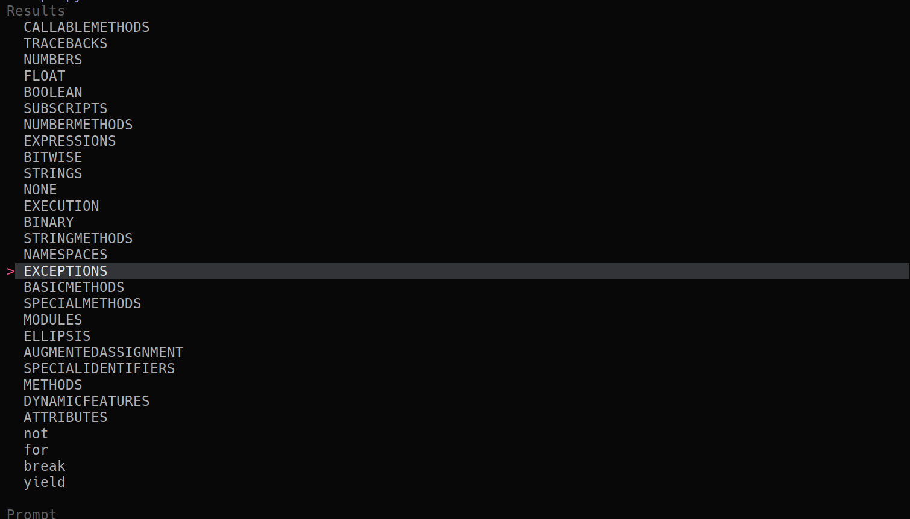

## 🔭 telescope-pydoc.nvim

A Telescope extension to search and view Python documentation using `pydoc`.



###  Installation

Add the plugin to your **Telescope** dependencies. If you are using `lazy.nvim`, your configuration would look like this:

```lua
{
  'nvim-telescope/telescope.nvim',
  dependencies = {
    'rionnwastaken/telescope-pydoc.nvim',
  },
  config = function()
    require('telescope').setup({
      extensions = {
        pydoc = {
          command = 'pydoc', -- Default command
        },
      },
    })
    
    -- Load the extension
    pcall(require('telescope').load_extension, 'pydoc')
  end
}
```

###  Configuration

You can customize the command used to fetch documentation (useful if you use `python3 -m pydoc` or a specific virtualenv path):

```lua
extensions = {
  pydoc = {
    command = 'pydoc',
  },
}
```

###  Usage

To open the picker and search through all available Python documentation, use the following function call:

```lua
require('telescope').extensions.pydoc.show_picker({ all = true })
```

**Tip:** You can bind this to a keymap in your `init.lua` for quicker access:

```lua
vim.keymap.set('n', '<leader>pd', function()
  require('telescope').extensions.pydoc.show_picker({ all = true })
end, { desc = "[P]y[D]oc Search" })
```

